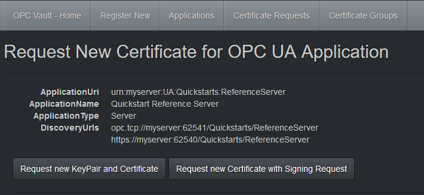
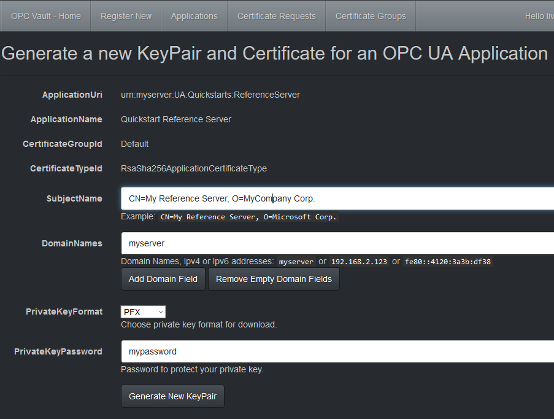

# Build and Deploy the Azure Industrial IoT OPC UA Certificate Management Service and dependencies

This article explains how to deploy the OPC UA Certificate Management Service in Azure.

## Prerequisites

### Install required software

Currently the build and deploy operation is limited to Windows.
The samples are all written for .NetStandard, which is needed to build the service and samples for deployment.
All the tools you need for .Net Standard come with the .Net Core tools. See [here](https://docs.microsoft.com/en-us/dotnet/articles/core/getting-started) for what you need.

1. [Install .NET Core 2.1+][dotnet-install].
2. [Install Docker][docker-url].
4. Install the [Azure Command Line tools for PowerShell][powershell-install].
5. Sign up for an [Azure Subscription][azure-free].

### Clone the repository

If you have not done so yet, clone this Github repository.  Open a command prompt or terminal and run:

```bash
git clone https://github.com/Azure/azure-iiot-opc-vault-service && cd azure-iiot-opc-vault-service 
```

or clone the repo directly in Visual Studio 2017.

### Build and Deploy the Azure service on Windows

A Powershell script provides an easy way to deploy the OPC UA Vault service and the application.<br>

1. Open a Powershell window at the repo root. 
3. Go to the deploy folder `cd deploy`
5. Start the deployment with `.\deploy.ps1` for interactive installation<br>
or enter a full command line:  
`.\deploy.ps1  -subscriptionName "MySubscriptionName" -resourceGroupLocation "East US" -tenantId <myTenantId> -resourceGroupName <myResourceGroup>`
6. Follow the instructions in the script to login to your subscription and to provide additional information
9. After a successful build and deploy operation you should see the following message:

```
To access the web client go to:
https://myResourceGroup-app.azurewebsites.net

To access the web service go to:
https://myResourceGroup-service.azurewebsites.net

To start the local docker GDS server:
.\myResourceGroup-dockergds.cmd

To start the local dotnet GDS server:
.\myResourceGroup-gds.cmd
```
In case you run into issues please follow the steps [below](#Troubleshooting-deployment-failures).

6. Give the web app and the web service a few minutes to start up for the first time.
10. Open your favorite browser and open the application page: `https://myResourceGroup-app.azurewebsites.net`
11. To take a look at the Swagger Api open: `https://myResourceGroup-service.azurewebsites.net`
13. To start a local GDS server with dotnet start `.\myResourceGroup-gds.cmd` or with docker start `.\myResourceGroup-dockergds.cmd`.

As a sidenote, it is possible to redeploy a build with exactly the same settings. Be aware that such an operation renews all application secrets and may reset some settings in the AAD application registrations.

### Create the root CA certificate

1. Open your certificate service at `https://myResourceGroup-app.azurewebsites.net` and login.
2. Navigate to the `Certificate Groups` page.
3. There is one `Default` Certificate Group listed. Click on `Edit`.
4. In `Edit Certificate Group Details` you can modify the Subject Name and Lifetime of your CA and application certificates.
5. Enter a valid Subject in the valid, e.g. `CN=My CA Root, O=MyCompany, OU=MyDepartment`.
6. Click on the `Save` button.
1. If you hit a 'forbidden' error at this point, the user you are logged in with doesn't have the rights to modify or create a new root cert. By default the user who deployed the service has management and signing roles with the service, other users need to be added to the 'Approver', 'Writer' or 'Administrator' roles as appropriate in the AzureAD application registration.
7. Click on the `Details` button. The `View Certificate Group Details` should display the updated information.
8. Click on the `Renew CA Certificate` button to issue your first root CA certificate. Press `Ok` to proceed.
9. After a few seconds the the `Certificate Details` are shown. Press `Issuer` or `Crl` to download the latest CA certificate and CRL for distribution to your OPC UA applications.
10. Now the OPC UA Certificate Management Service is ready to issue certificates for OPC UA applications.

### Register your OPC UA application and create a new key pair and certificate

1. Open your certificate service at `https://myResourceGroup-app.azurewebsites.net` and login.
2. Navigate to the `Register New` page.
1. For an application registration a user needs to have at least the 'Writer' role assigned.
2. The entry form follows naming conventions in the OPC UA world. As an example, in the picture below the settings for the OPC UA Reference Server sample in the OPC UA .NetStandard stack is shown:


5. Press the `Register` button to register the application in the certificate serice database. The workflow directly guides the user to the next step to request a signed certificate for the application.



6. Press the 'Request new KeyPair and Certificate' to request a new certificate for your application.



7. Fill in the form with a subject, the domain names and choose PEM or PFX with password for the private key. Press the `Generate New Certificate`button create the certificate request.


8. Approve or Reject the certificate to start or cancel the actual creation of the key pair and the signing operation of the certificate. The new key pair is created and stored securely in Azure Key Vault until downloaded by the certificate requester. The resulting certificate with public key is signed by the CA. These operations may take a few seconds to finish.


9. The resulting private key (PFX or PEM) and certificate (DER) can be downloaded from here in the format selected as binary file download. A base64 encoded version is also available, e.g. to copy paste the certificate to a command line or text entry. 
10. Once the private key is downloaded and stored securely, it can be deleted from the service with the `Delete Private Key` button. The certificate with public key remains available for future use.
11. Due to the use of a CA signed certificate, the CA cert and CRL should be downloaded here as well.
12. Now it depends on the OPC UA device how to apply the new key pair. Typically, the CA cert and CRL are copied to a `trusted` folder, while the public and private key of the application certificate is applied to a `own` folder. Some device may already support Server Push for Certificate updates. Please refer to the documentation of your OPC UA device.

## Troubleshooting deployment failures

### Resource group name

Ensure you use a short and simple resource group name.  The name is used also to name resources as such it must comply with resource naming requirements.  

### Website name already in use

It is possible that the name of the website is already in use.  If you run into this error, you need to use a different resource group name.

### Azure Active Directory (AAD) Registration 

The deployment script tries to register 3 AAD applications in Azure Active Directory.  
Depending on your rights to the selected AAD tenant, this opartion might fail.   There are 2 options:

1. If you chose a AAD tenant from a list of tenants, restart the script and choose a different one from the list.
2. Alternatively, deploy a private AAD tenant in another subscription, restart the script and select to use it.

## Deployment script options

The script takes the following parameters:


```
-resourceGroupName
```

Can be the name of an existing or a new resource group.

```
-subscriptionId
```


Optional, the subscription id where resources will be deployed.

```
-subscriptionName
```


Or alternatively the subscription name.

```
-resourceGroupLocation
```


Optional, a resource group location. If specified, will try to create a new resource group in this location.


```
-tenantId
```


AAD tenant to use. 


[azure-free]:https://azure.microsoft.com/en-us/free/
[powershell-install]:https://azure.microsoft.com/en-us/downloads/#PowerShell
